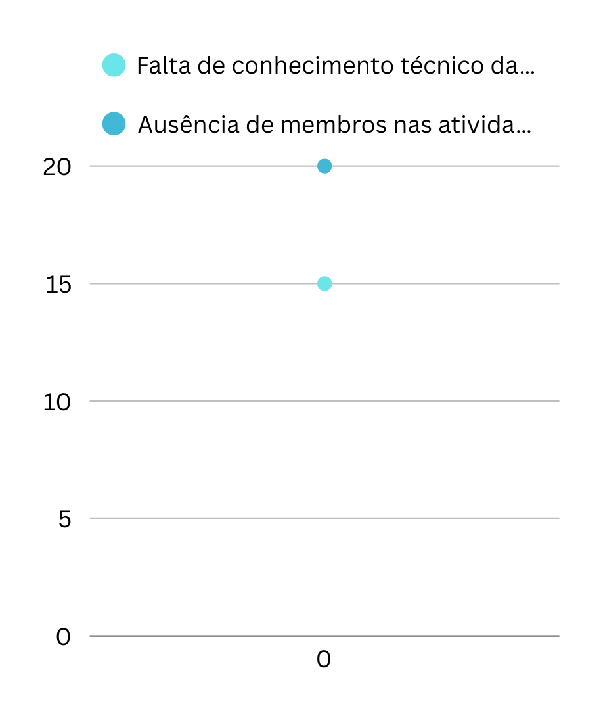
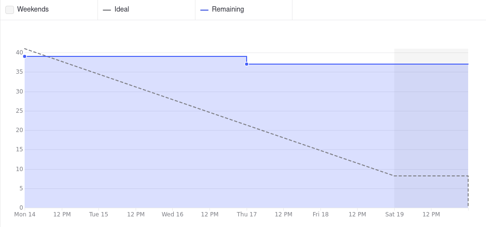
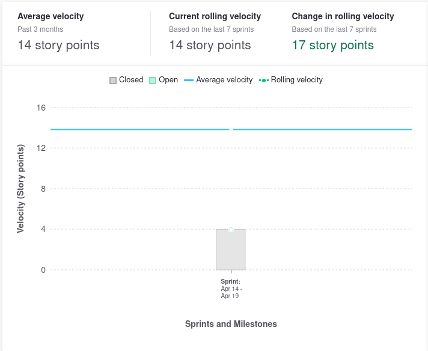
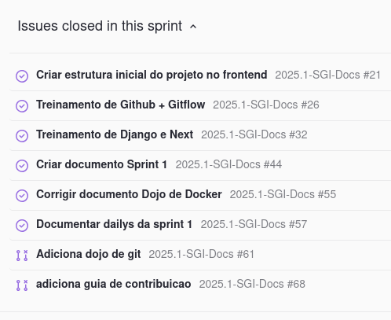

# Review

Documenta a realização da Review com o time.

**Data:** 26/04/2025      
**Horário:** 14h         
**Local:** Discord 

## Riscos

## Burndown

## Velocity

## Resumo da sprint

## Lista de presença

| Nome                              | Presente (✅/❌) | Justificativa da Ausência               |
|-----------------------------------|-------------------|-----------------------------------------|
| Danilo Domingo                    |     ✅           |                                         |
| Gabi Ribeiro                      |     ❌           |    Motivos Pessoais                                     |
| Jackes Tiago                      |     ✅           |                                         |
| Arthur Gomes Oliveira             |     ✅           |                                         |
| Caio Vilas Boas Miranda           |     ✅           |                                         |
| Carlos Eduardo Figueiredo Coelho  |     ✅           |                      |
| Daniel da Silva Batista           |     ✅           |                                         |
| Guilherme Nascimento Tegnoue      |     ✅           |                                         |
| Gustavo Augusto Da Silva Sousa    |     ✅           |                                         |
| Janio Lucas Pereira Carrilho      |     ✅           |                                         |
| João Guilherme Capozzi Gonçalves  |     ✅           |                                         |
| Joao Guilherme Lima Veras         |     ❌           |                                         |
| Pedro Vieira Antunes              |     ✅           |                                         |

## Histórico de Versões

| Versão | Data       | Modificação                | Autor(es)         |
|--------|------------|----------------------------|-------------------|
|   1.0  | 28/04/2025 | Adiciona ata da reunião    | Jackes         | 
|   2.0  | 02/05/2025 | Reorganização da estrutura do documento | Jackes |