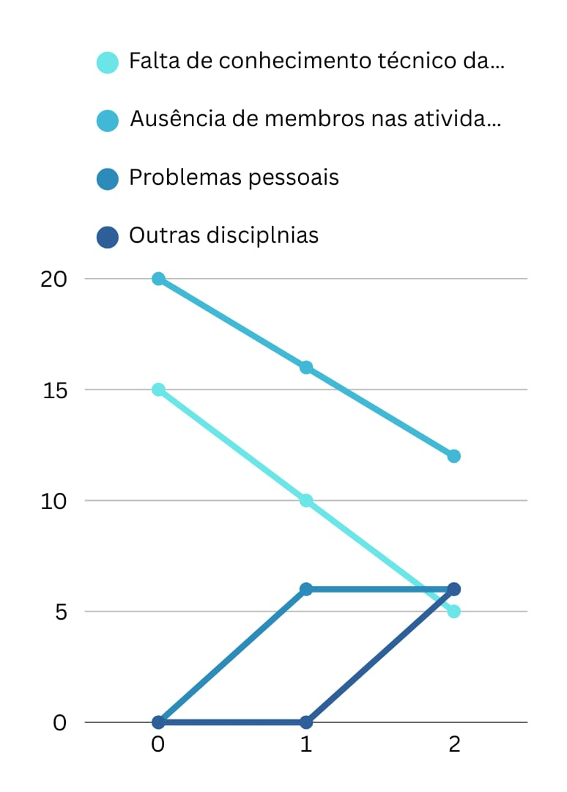
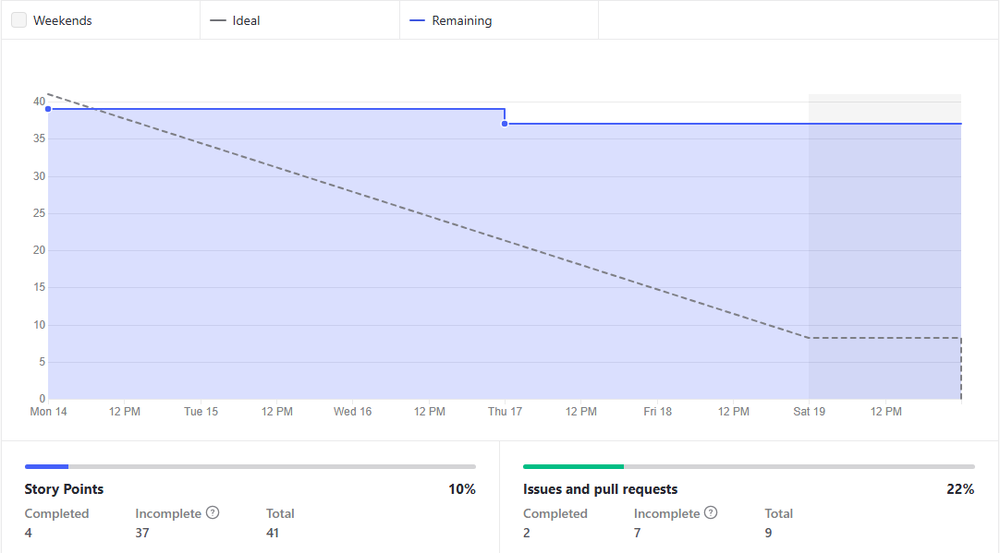
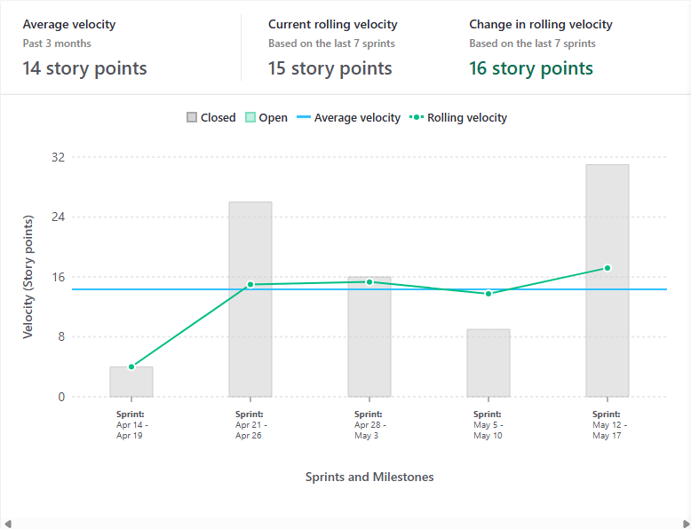
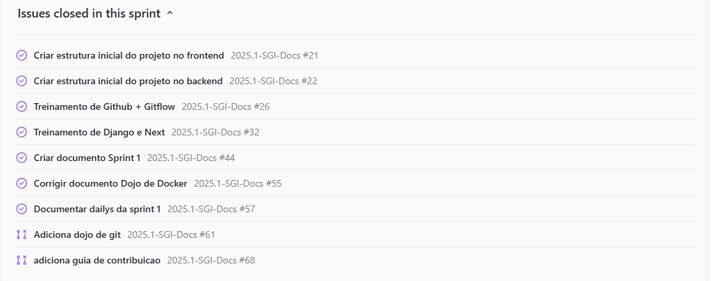

# Review 

Documenta a realização da Review com o time.

**Data:** 19/05/2025      
**Horário:** 14h         
**Local:** Discord 

## Riscos

## Burndown

## Velocity

## Resumo da Sprint

## Lista de presença

| Nome                             | Presente (✅/❌) | Justificativa da Ausência |
| -------------------------------- | -------------- | ------------------------- |
| Danilo Domingo                   | ✅              |                           |
| Gabi Ribeiro                     | ❌              | Motivos Pessoais          |
| Jackes Tiago                     | ✅              |                           |
| Arthur Gomes Oliveira            | ✅              |                           |
| Caio Vilas Boas Miranda          | ✅              |                           |
| Carlos Eduardo Figueiredo Coelho | ✅              |                           |
| Daniel da Silva Batista          | ✅              |                           |
| Guilherme Nascimento Tegnoue     | ✅              |                           |
| Gustavo Augusto Da Silva Sousa   | ✅              |                           |
| Janio Lucas Pereira Carrilho     | ✅              |                           |
| João Guilherme Capozzi Gonçalves | ✅              |                           |
| Joao Guilherme Lima Veras        | ✅              |                           |
| Pedro Vieira Antunes             | ✅              |                           |

## Histórico de Versões

| Versão | Data       | Modificação               | Autor(es) |
| ------ | ---------- | ------------------------- | --------- |
| 1.0    | 19/05/2025 | Adiciona sprint 2         | Danilo    |
| 1.1    | 20/05/2025 | Adiciona gráfico de risco | Danilo    |