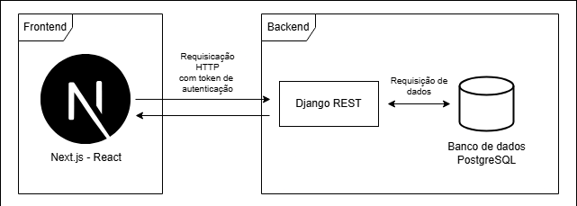
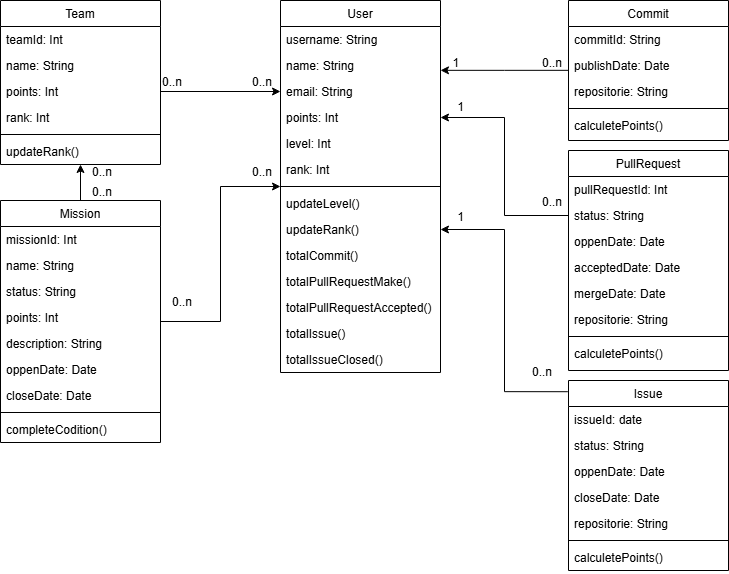

# Documento de Arquitetura

## Histórico de Versão

| Data       | Versão | Descrição                                | Autor(es)      |
| ---------- | ------ | ---------------------------------------- | -------------- |
| 17/05/2025 | 1.0    | Criação do documento de arquitetura      | Danilo Domingo |
| 17/05/2025 | 1.1    | Adição dos diagramas de classe e relação | Danilo Domingo |

---

## Introdução

### Finalidade
Este documento apresenta a arquitetura do sistema GitFica, detalhando as decisões arquiteturais, os componentes do sistema e suas interações. Serve como guia para desenvolvedores e stakeholders compreenderem a estrutura técnica do projeto.

### Escopo
O documento abrange a visão arquitetural completa do GitFica, incluindo frontend, backend, persistência de dados, integrações externas e infraestrutura de implantação.

### Definições, Acrônimos e Abreviações
* **API**: Application Programming Interface
* **REST**: Representational State Transfer
* **JWT**: JSON Web Token
* **OAuth**: Open Authorization
* **DRF**: Django Rest Framework
* **CI/CD**: Continuous Integration/Continuous Deployment
* **Docker**: Plataforma de containerização
* **MVC**: Model-View-Controller
* **MVP**: Minimum Viable Product

## Representação da Arquitetura

### Diagrama de Relações

### Visão Geral
O GitFica adota uma arquitetura cliente-servidor separando claramente as responsabilidades entre frontend e backend. O sistema utiliza:

* **Frontend**: Next.js (React) com TypeScript
* **Backend**: Django Rest Framework
* **Banco de Dados**: PostgreSQL
* **Integração Externa**: GitHub API
* **Infraestrutura**: Docker para containerização

### Padrões Arquiteturais

#### Cliente-Servidor
A separação clara entre cliente (frontend) e servidor (backend) permite o desenvolvimento independente de cada componente e facilita a escalabilidade do sistema.

#### REST
A comunicação entre frontend e backend é feita através de uma API REST, utilizando requisições HTTP e payloads JSON.

#### MVC (Adaptado)
O backend segue uma variação do padrão MVC através do Django:
* **Model**: Representação dos dados e regras de negócio
* **View**: Controladores que processam requisições e retornam respostas
* **Template**: Não utilizado tradicionalmente em APIs REST, mas substituído pelas respostas JSON

## Restrições e Metas Arquiteturais

### Restrições
* O sistema deve ser acessível via navegadores web modernos
* Deve integrar-se à API do GitHub para obtenção de dados
* Requisitos de segurança para autenticação e autorização
* Escalabilidade para suportar múltiplos usuários simultâneos
* Baixa latência para operações críticas

### Metas Arquiteturais
* **Modularidade**: Componentes com baixo acoplamento e alta coesão
* **Manutenibilidade**: Facilidade de correção de bugs e implementação de novas funcionalidades
* **Testabilidade**: Estrutura que facilite a implementação de testes automatizados
* **Desempenho**: Otimização para operações que envolvem consultas à API do GitHub
* **Segurança**: Proteção adequada dos dados dos usuários

## Visão de Casos de Uso

### Principais Casos de Uso
1. Autenticação de usuário via GitHub
2. Visualização de estatísticas e métricas pessoais
3. Participação em rankings e desafios
4. Conquista de badges e níveis
5. Gerenciamento de equipes
6. Recebimento e cumprimento de missões
7. Visualização de notificações

## Visão Lógica

### Diagrama de Classes

O diagrama de classes a seguir representa as principais entidades do sistema GitFica e seus relacionamentos, demonstrando a estrutura dos objetos, atributos e métodos que compõem o modelo de domínio da aplicação:

### Visão Geral
A arquitetura lógica do GitFica é organizada em camadas distintas:

1. **Camada de Apresentação**: Interface do usuário desenvolvida em Next.js
2. **Camada de API**: Endpoints REST expostos pelo backend
3. **Camada de Serviços**: Lógica de negócio e processamento de dados
4. **Camada de Acesso a Dados**: Persistência dos dados e acesso ao banco
5. **Camada de Integração Externa**: Comunicação com a API do GitHub

### Componentes Principais

#### Frontend (Next.js com TypeScript)

O frontend do GitFica é desenvolvido com Next.js integrado ao TypeScript, combinando com framework React que possibilita renderização do lado do servidor (SSR) e geração de páginas estáticas com tipagem estática. Esta combinação proporciona detecção de erros em tempo de compilação, melhor documentação de código e compleição no ambiente de desenvolvimento. A estrutura é organizada de forma modular para facilitar o desenvolvimento e a manutenção.

**Componentes Principais**:

* **Páginas**: Componentes React para cada rota da aplicação, organizados seguindo a estrutura de roteamento do Next.js
* **Serviços**: Módulos responsáveis por se comunicar com a API backend, encapsulando a lógica de requisições HTTP
* **Componentes UI**: Elementos reutilizáveis da interface, como cards, botões e formulários customizados
* **Store**: Gerenciamento de estado global utilizando Redux Toolkit para manter dados consistentes entre componentes
* **Hooks**: Funções customizadas para compartilhar lógica entre componentes, como autenticação, notificações e acesso ao estado
* **Public**: Arquivos estáticos como imagens, ícones, badges e assets

**Estrutura de Diretórios**:

* **frontend**: Diretório raiz do projeto frontend
  * **next**: Arquivos de configuração específicos do Next.js para personalização do servidor e build
  * **node_modules**: Repositório local de todas as dependências instaladas via npm/yarn
  * **public**: Arquivos estáticos acessíveis diretamente pelo navegador sem processamento
  * **src**: Código fonte principal da aplicação, seguindo princípios de organização modular
    * **components**: Componentes React reutilizáveis em toda a aplicação
      * **[ComponenteName]**: Diretório isolado para cada componente, seguindo padrão de atomicidade
        * **index.tsx**: Implementação principal do componente React
        * **styles.ts**: Estilização específica utilizando Styled Components ou Emotion
    * **config**: Configurações globais da aplicação como endpoints, constantes e variáveis de ambiente
    * **contexts**: Implementação de contextos React para gerenciamento de estado distribuído
    * **lib**: Bibliotecas e abstrações de código compartilhado entre diferentes partes da aplicação
    * **pages**: Definição de rotas seguindo a convenção de roteamento baseado em arquivo do Next.js
      * **[route]**: Pasta que define uma rota dinâmica na aplicação
        * **index.tsx**: Componente principal renderizado para esta rota
      * **_app.tsx**: Componente de mais alto nível que envolve todas as páginas
      * **_document.tsx**: Personalização do documento HTML para ajustes no head e estrutura inicial
    * **services**: Camada de serviços para comunicação com APIs externas e encapsulamento de lógica de negócio
    * **styles**: Arquivos de estilização global, temas, variáveis CSS e mixins compartilhados
    * **types**: Definições de tipos TypeScript e interfaces para garantir tipagem estática consistente
    * **utils**: Funções utilitárias e helpers reutilizáveis em toda a aplicação
  * **.env.local**: Armazenamento seguro de variáveis de ambiente para desenvolvimento local
  * **next-env.d.ts**: Definições de tipos TypeScript específicas para o ecossistema Next.js
  * **next.config.js**: Arquivo de configuração para personalização avançada do build e runtime do Next.js
  * **package.json**: Manifesto do projeto com dependências, scripts e metadados
  * **tsconfig.json**: Configuração do TypeScript com definições de compilação e checagem de tipos

#### Backend (Django Rest Framework)

O backend do GitFica utiliza Django Rest Framework, seguindo princípios de modularidade e separação de responsabilidades. A estrutura é organizada em componentes principais e segue um layout de diretórios padronizado.

**Componentes Principais**:

* **Models**: Entidades do sistema e suas relações, representando o esquema de dados e implementando regras de negócio básicas
* **Views/Viewsets**: Controladores para processamento de requisições HTTP, implementando a lógica de roteamento e manipulação de recursos
* **Serializers**: Responsáveis pela conversão bidirecional entre formatos JSON e objetos Python, incluindo validação de dados
* **Services**: Camada contendo a lógica de negócio complexa, desacoplada das views para melhor separação de responsabilidades
* **GitHub Integration**: Módulo especializado para comunicação com a API do GitHub, abstraindo a complexidade de autenticação e requisições

**Estrutura de Diretórios**:

* **apps**: Cada aplicação contém uma funcionalidade independente do sistema
  * **migrations**: Pasta com as migrações para o banco de dados
  * **static**: Pasta com arquivos CSS, JavaScript e imagens
  * **tests**: Arquivos de testes referentes ao app
  * **templates**: Arquivos HTML do app
  * **locale**: Traduções referentes ao app
  * **models**: Arquivos de models do app
  * **views**: Arquivos de views do app
  * **forms**: Arquivos de formulários do app
  * **admin**: Arquivo de conexão do app com o admin
  * **urls.py**: Arquivo que mapeia as views com templates de cada app
  * **__init__.py**: Arquivo que transforma o app em um pacote Python
  * **apps.py**: Mapeia a pasta que o contém como um app
  * **utils.py**: Arquivos de validação dos apps

* **config**: Pasta com as configurações do projeto Django
  * **urls.py**: Inclui todos os URLs.py dos apps
  * **__init__.py**: Arquivo que transforma as configurações em um pacote Python
  * **settings**: Arquivos com as configurações básicas da aplicação
  * **wsgi.py**: Especificação para interface entre servidores web e aplicações web

* **manage.py**: Arquivo criado automaticamente pelo Django REST para gerenciamento de comandos
* **docs**: Documentação da aplicação
* **compose**: Pasta com arquivos do Docker
* **utility**: Arquivos para auxílio na instalação do software
* **requirements**: Organiza todos os pacotes/componentes que a aplicação utiliza

## Visão de Processo

### Principais Processos
1. **Autenticação**: Fluxo OAuth com GitHub
2. **Sincronização de Dados**: Atualização periódica das estatísticas do usuário
3. **Gamificação**: Cálculo de pontos, níveis e conquistas
4. **Notificações**: Envio e processamento de notificações

## Visão de Implantação

### Ambiente de Produção
* **Frontend**: Contêiner Docker com Next.js
* **Backend**: Contêiner Docker com Django Rest Framework
* **Banco de Dados**: Contêiner Docker com PostgreSQL
* **Proxy Reverso**: Contêiner Docker com Nginx

### CI/CD
O processo de integração e entrega contínuas é implementado utilizando GitHub Actions:
1. **Build**: Compilação e teste da aplicação
2. **Test**: Execução de testes automatizados
3. **Deploy**: Implantação em ambiente de produção

## Visão de Dados

### Principais Entidades
* **User**: Informações do usuário e sua conexão com GitHub
* **GitHubStats**: Estatísticas coletadas da conta GitHub do usuário
* **Achievement**: Conquistas e badges disponíveis no sistema
* **UserAchievement**: Relação entre usuários e conquistas obtidas
* **Mission**: Missões disponíveis no sistema
* **UserMission**: Relação entre usuários e missões em andamento/concluídas
* **Team**: Equipes criadas pelos usuários

## Decisões Arquiteturais

### Tecnologias Escolhidas

#### Django Rest Framework
Escolhido por sua robustez, segurança integrada e rapidez no desenvolvimento de APIs REST. O Django ORM facilita a interação com o banco de dados e o ecossistema oferece diversas bibliotecas para integração com serviços externos.

#### Next.js
Framework React com renderização do lado do servidor (SSR) e geração de páginas estáticas, proporcionando melhor SEO e performance. Oferece roteamento simplificado e estrutura organizada para aplicações frontend complexas.

#### PostgreSQL
Banco de dados relacional robusto, com suporte a JSON e recursos avançados de consulta que serão úteis para armazenar e consultar dados.

#### Docker
Permite a containerização da aplicação, garantindo consistência entre os ambientes de desenvolvimento, teste e produção.

### Padrões Adotados

#### Repository Pattern
Abstração da camada de acesso a dados, facilitando a substituição do mecanismo de persistência e os testes unitários.

#### Service Layer
Implementação da lógica de negócio em serviços, separando responsabilidades e permitindo reutilização de código.

#### JWT Authentication
Autenticação baseada em tokens para comunicação entre frontend e backend, após autenticação inicial via GitHub OAuth.

## Qualidade

### Estratégias para Garantir a Qualidade
1. **Testes Automatizados**:
   * Testes unitários para componentes e serviços
   * Testes de integração para APIs
   * Testes end-to-end para fluxos completos

2. **Análise Estática de Código**:
   * ESLint para JavaScript/TypeScript
   * Pylint para Python
   * SonarQube para análise contínua

3. **Revisão de Código**:
   * Pull Requests obrigatórios
   * Code Reviews por pelo menos um desenvolvedor

4. **Monitoramento**:
   * Logging centralizado
   * Métricas de desempenho
   * Alertas para falhas

## Implementação

### Principais Bibliotecas e Frameworks

#### Frontend
* **React**: Biblioteca JavaScript para construção de interfaces de usuário baseada em componentes, permitindo desenvolvimento declarativo e reativo
* **Next.js**: Framework React para renderização híbrida (SSR e SSG), com otimizações de performance e melhor SEO
* **Axios**: Cliente HTTP para comunicação com a API backend, oferecendo interceptors e melhor tratamento de erros
* **Chart.js**: Biblioteca de visualização de dados para criação de gráficos interativos das métricas e estatísticas do usuário
* **Material-UI**: Biblioteca de componentes UI implementando o Material Design, proporcionando uma interface consistente e moderna
* **Redux Toolkit**: Solução oficial para gerenciamento de estado global, simplificando a configuração do Redux e reduzindo o código boilerplate

#### Backend
* **Django Rest Framework**: Framework para construção de APIs REST sobre o Django, oferecendo serialização, autenticação e ferramentas de visualização
* **PyGithub**: Cliente Python oficial para a API do GitHub, facilitando a integração com seus serviços e endpoints
* **Celery**: Sistema distribuído para processamento assíncrono de tarefas, utilizado para operações demoradas como sincronização de dados do GitHub
* **Django OAuth Toolkit**: Implementação de autenticação OAuth 2.0 para Django, permitindo integração segura com o GitHub
* **Django CORS Headers**: Middleware para gerenciamento de CORS (Cross-Origin Resource Sharing), facilitando a interação segura entre frontend e backend