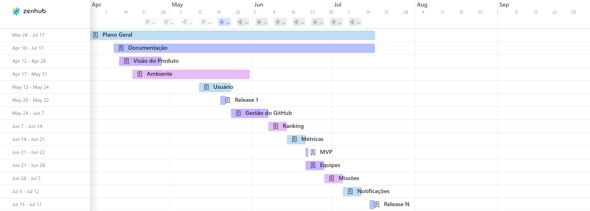

# Documento de Gerenciamento de Tempo

## Introdução

Este documento apresenta o plano de gerenciamento de tempo do projeto **GitFica**, estruturado com o auxílio de um gráfico de Gantt, conforme a imagem. A ferramenta utilizada para a construção deste roadmap foi o **ZenHub**, permitindo uma visualização clara e interativa dos épicos, marcos e entregas ao longo do desenvolvimento do projeto.

O cronograma contempla o período de **março a julho de 2025**, com a organização dos trabalhos distribuída em épicos temáticos que agrupam atividades relacionadas, possibilitando um acompanhamento eficiente da evolução do projeto. Os épicos estão categorizados entre **entregas de código**, **planejamento e documentação**, e **apresentações de marcos (releases)**.

Este roadmap orienta a execução do projeto e serve como ferramenta de acompanhamento contínuo, garantindo que todas as etapas sejam concluídas dentro dos prazos estabelecidos e com a qualidade esperada.

## Gráfico de Gantt

### Categorias de Épicos

- **Entregas de Código**:
    -  **Usuário**: Implementação das funcionalidades relacionadas à criação e gerenciamento de usuários.
    - **Gestão do GitHub**: Integração e automatização de processos utilizando a API do GitHub.
    - **Ranking**: Desenvolvimento de sistemas de pontuação e classificação.
    - **Métricas**: Coleta e visualização de dados para avaliação de desempenho.
    - **Equipes**: Criação de funcionalidades para organização de usuários em grupos colaborativos.
    - **Missões**: Implementação de tarefas atribuídas aos usuários, relacionadas aos objetivos do sistema.
    - **Notificações**: Sistema de alertas e comunicações internas no ambiente da aplicação.

- **Releases (Apresentações)**:
    -  **Release 1** (maio): Primeira entrega de funcionalidades e demonstração parcial do sistema.
    - **MVP** (junho): Apresentação do Produto Mínimo Viável, validando os componentes essenciais.
    - **Release N** (julho): Entrega final e apresentação consolidada do sistema implementado.

- **Planejamento e Suporte**:
    -  **Plano Geral**: Estrutura macro do cronograma, com as principais fases do projeto.
    - **Documentação**: Produção de documentação técnica e de apoio ao desenvolvimento.
    - **Visão do Produto**: Definição dos objetivos e requisitos do sistema.
    - **Ambiente**: Preparação do ambiente de desenvolvimento e ferramentas necessárias.

## Histórico de Versões

| Versão | Data       | Modificação                | Autor(es)         |
|--------|------------|----------------------------|-------------------|
|   1.0  | 19/05/2025 | Adiciona documento    | Gabrielle         |