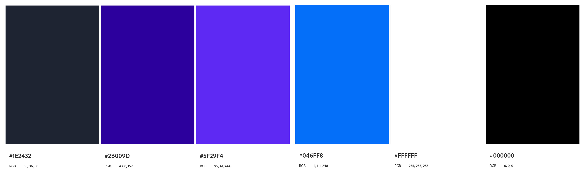

# Identidade Visual

## Logo

A logo do GitFica representa um capacete para gato, remetendo a logo do próprio GitHub que é um gato e uma espada, buscamos esse traço de algo medieval misturado com a estética pixelizada, lembrando bastante os antigos jogos RPGs.

### Logo com contraste

Versão da logo para uso em fundos escuros.

## Cores

A paleta de cores do GitFica foi escolhida para transmitir modernidade e profissionalismo, mesclando tons de azul e roxo com um toque de preto para dar contraste.

### Cores Principais

 `#1E2432` - Utilizado para o background.

 `#2B009D` - Utilizado no Header e texto em destaque

 `#5F29F4` - Utilizado como cor primária em componentes do sistema, como botões e afins.

 `#046FF8` - Utilizado como cor secundária em componentes do sistema.

 `#FFFFFF` - Utilizado como cor principal para os textos, também utilizado em bordas de componentes.

 `#000000` - Utilizado como cor alternativa para os textos.

### Cores Secundárias

Uma paleta escolhida para avisos e destaques.

 `#DC3545` - Utilizado para indicar texto e box de falha.

 `#FFC107` - Utilizado para indicar texto e box de aviso.

 `#28A745` - Utilizado para indicar texto e box de sucesso.

## Tipografia

Para os textos da aplicação será utilizada a fonte Roboto, que pode ser encontrada em: [Google Fonts - Roboto](https://fonts.google.com/specimen/Roboto)

### Hierarquia tipográfica

Os tamanhos dos textos devem seguir o padrão estabelecido:

- Títulos: 24px
- Subtítulos: 18px
- Textos em botões: 14px
- Outros textos: 14px

### Demonstração

    <strong>Títulos: </strong>Lorem ipsum dolor sit amet 
    <strong>Subtítulos: </strong>Lorem ipsum dolor sit amet 
    <strong style="font-size: 14px;">Textos em botões: </strong><button style="font-size: 14px; padding: 8px 16px; margin: 8px 0; background: #5F29F4; color: #ffffff;cursor: pointer; border-radius: 8px">Lorem ipsum dolor sit amet</button> 
    <strong style="font-size: 14px;">Outros textos: </strong>Lorem ipsum dolor sit amet

## Estilos para componentes

Foi definido alguns padrões para construções de componentes, para garantir o padrão do sistema:

- Border radius em botões: 8px
- Border radius em cards: 16px
- Border em tabelas: 1px solid #FFFFFF;

## Histórico de Versões

| Versão | Data       | Modificação                | Autor(es)         |
|--------|------------|----------------------------|-------------------|
|   1.0  | 25/04/2025 | Adiciona documento de identidade visual    | Danilo         |
