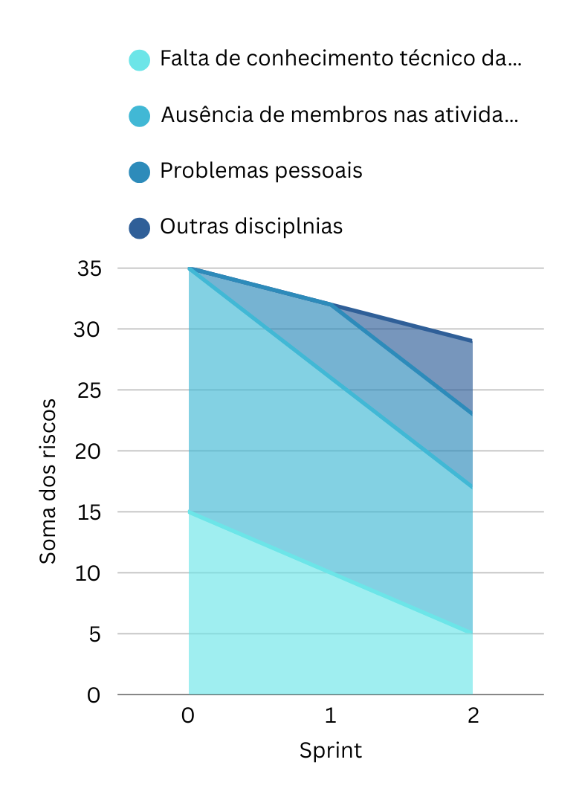

# Planejamento de risco - Análise 

## Plano de mitigação
### Release 1

| Risco                                         | Categoria    | Timeline | Plano de mitigação                                                                                                                                                        | Efetivo |
|----------------------------------------------|--------------|----------|--------------------------------------------------------------------------------------------------------------------------------------------------------------------------|---------|
| Ausência de membros nas atividades           | Organização  | 2        | Conversa via videochamada no qual os membros ligam as câmeras                                                                                                            | ✅       |
| Inconsistência de requisitos                 | Requisitos   | 3        | Conversa com o cliente tentando esclarecer melhor o que ele deseja. Tirar todas as dúvidas que forem surgindo.                                                           | ✅       |
| Falta de conhecimento técnico da equipe      | Técnico      | 6        | Treinamentos nas linguagens que estamos utilizando e pareamentos entre os membros de MDS e EPS                                                                           | ✅       |
| Problemas pessoais                           | Pessoal      | 1        | Para esse risco existe a complicação de que ele é repentino. O membro com dificuldade deve tentar informar a equipe com alguns dias de antecedência.                     | ✅       |
| Troca do início e término das sprints        | Organização  | 1        | A equipe deve se organizar melhor para não ocorrer essa troca de datas, conversando com todos os membros para entender qual o melhor dia para o sprint planning, review e retrospective. | ✅       |
| Outras disciplinas                            | Pessoal      | 1        | Os membros devem informar com antecedência quais semanas estarão mais ocupados com outras disciplinas e assim não poderão contribuir muito com o projeto.               | ✅       |
| Problemas de comunicação                     | Organização  | 1        | Os membros devem tentar explicar melhor suas dificuldades. A equipe deve pensar em alternativas ao escutar a dificuldade do integrante da equipe                         | ✅       |
| Retrabalho por entregas mal feitas           | Técnico      | 6        | Os membros de MDS devem se esforçar mais para entregar os requisitos mínimos das histórias de usuário. Devem se basear no protótipo e tirar dúvidas com os membros de EPS. | ✅       |
| Falta de comprometimento com as tarefas      | Pessoal      | 6        | A equipe de EPS tem conversado com a equipe de MDS sobre o ritmo de suas entregas.                                                                                       | ✅       |
| Sobrecarga de trabalho de alguns membros     | Organização  | 3        | A equipe de EPS e 1 membro de MDS tiveram uma sobrecarga muito grande nas últimas sprints, por isso foi decidido que a carga de trabalho seria reduzida.                | ✅       |
| Retirada de matéria                          | Pessoal      | 6        | O escopo foi reduzido pela quantidade reduzida de membros                                                                                                                 | ✅       |

A equipe demonstrou excelente proatividade e organização na identificação, categorização e mitigação dos riscos associados à release. Foram levantados 11 riscos, cobrindo diferentes categorias: Organização, Requisitos, Técnico e Pessoal — o que mostra uma visão sistêmica dos desafios enfrentados.
Pontos positivos:

- 100% dos riscos foram tratados com planos de mitigação efetivos (todos marcados como “✅”). Isso revela maturidade na gestão da equipe e capacidade de reação frente aos problemas.
- Riscos críticos (com Timeline alta = 6) como falta de conhecimento técnico, retrabalho por entregas mal feitas, falta de comprometimento e retirada de matéria foram abordados com medidas concretas, como treinamentos, reorganização de escopo e pareamentos. Isso indica preocupação com a sustentabilidade do projeto.
- Problemas organizacionais e pessoais, com menor impacto (Timeline 1), também receberam atenção — o que ajuda a manter um ambiente de trabalho colaborativo e previsível.
- Boa comunicação entre as subequipes (MDS e EPS), com feedback mútuo e divisão de responsabilidades, foi evidenciada em vários planos de mitigação.

Possíveis melhorias:
- A maioria das ações são reativas, ou seja, tratam o problema quando ele já ocorre. Para um nível mais avançado de maturidade em gerenciamento de riscos, seria interessante ver também ações preventivas padronizadas, como checklists recorrentes, mecanismos automáticos de acompanhamento de progresso ou reuniões específicas para revisão de riscos.
- A descrição de alguns planos é um pouco genérica (“a equipe deve se organizar melhor”, “devem explicar melhor as dificuldades”) — isso pode dificultar a mensuração da eficácia real da ação. Reforçar com métricas ou critérios de sucesso claros seria benéfico.

## Avaliação dos riscos envolvidos
### Release 1

**1. Tendência Geral**

- A soma total dos riscos diminui ao longo do tempo, do Sprint 0 ao Sprint 2.
- Isso indica que houve um esforço efetivo de mitigação, com redução significativa do impacto dos riscos no projeto.

**2. Falta de conhecimento técnico da equipe**

- Essa categoria representa a maior contribuição no Sprint 0 (aproximadamente 15 pontos na escala do gráfico).
- Há uma queda considerável até o Sprint 2, sugerindo que, apesar das dificuldades, ações como Dojos e treinamentos começaram a surtir efeito, mesmo que inicialmente o plano não tenha sido considerado plenamente efetivo.

**3. Ausência de membros nas atividades**

- Apresenta um valor intermediário no Sprint 0 e vai diminuindo até o Sprint 2.
- Isso mostra uma boa organização da equipe e sucesso em iniciativas como reuniões com vídeo ativo para promover o engajamento.

**4. Problemas pessoais**

- Aparecem com impacto menor e relativamente constante ao longo das sprints.
- Como são riscos de natureza imprevisível, a constância sugere que a equipe conseguiu manter estabilidade pessoal ou comunicou com antecedência quando necessário.

**5. Outras disciplinas**

- Aparece com baixo impacto, mas mais visível no Sprint 2.
- Isso pode indicar aumento de carga acadêmica em paralelo ao projeto, o que exige maior atenção e planejamento nas próximas etapas.

## Histórico de Versões

| Versão | Data       | Modificação                | Autor(es)         |
|--------|------------|----------------------------|-------------------|
|   1.0  | 18/05/2025 | Adiciona análise do planejamento de risco     | Jackes        |
